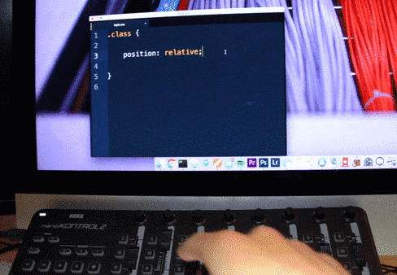

# Midi Controller Css

I type a lot of css, so I bought a Korg NanoKontrol 2 and built this lovely Atom package.
This usb midi controller is costless and very complete for its size. I bought a used one for 20€ ($25).
Each column of buttons controls the values of one css property, and each slider sets the px/percent/... values. Ordinary snippets are outdated, go midi snippets!

I recommend you to use this package with my [MarmWork](https://github.com/dimitrinicolas/marmwork) front-end framework.

You can have a look at [lib/actions.js](lib/actions.js) for a complete list of features.

PS: Most of the snippets only works with some popular PostCSS plugins, you can check my list on my [personnal front-end framework](https://github.com/dimitrinicolas/marmwork/blob/master/build/postcss.config.js).
